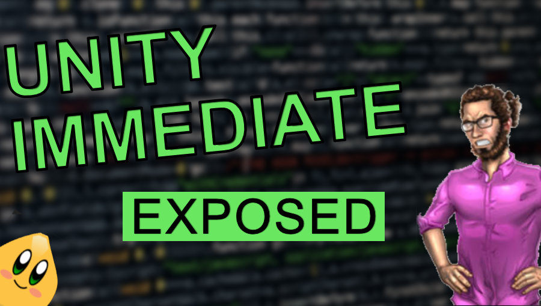

# Unity Immediate - The Gamedev Guru's Level 2

Let's have some fun with automation and the Unity Immediate Window package

This repository is based on an article posted in [The Gamedev Guru's Website](https://thegamedev.guru/unity-immediate-for-automated-playthroughs/). If you want to understand what's going on, I suggest you have a look there first!

The code you can use for the automated playthrough can be found below:

~~~~
IEnumerator SkipToFinalJump()
{
    // Fast-forward till the final jump section
    Time.timeScale = 2f;
    yield return new WaitForSeconds(3);

    yield return C.Move(1, 1);
    yield return C.Jump(1);         // Onto first platform
    yield return C.Jump(0.5F);      // Onto second platform
    yield return C.Jump(0.7F);      // Onto third platform
    yield return C.Move(1, 1);
    yield return C.Jump(1);         // Over flame
    yield return C.Move(1, 1.75f);
    yield return C.Move(-1, 0.75f); // Descend to second platform.
    yield return C.Move(1, 0.65f);  // Descend to ground level.
    yield return C.Jump(1);         // First sugar block

    yield return C.Move(1, 0.5f);
    yield return C.Jump(1.0f);      // Stomp over enemy head

    yield return C.Jump(0.8f);      // Stomp over second enemy head!

    yield return C.Jump(0.8f);      // Second batch of stacked sugar cubes

    yield return C.Move(1, 1.0f);   // Approach edge of next platform area

    // Testing the final jump section
    Time.timeScale = 1f;

    C.Gravity = 0.3f;               // Let's cheat a bit
    yield return C.Jump(0.3f);      // Super high jump to a new platform
    C.Gravity = 1.5f;               // Nothing happened here

    yield return C.Move(1, 2.5f);   // Walk into...

//    ScenesManager.Instance.CallNextScene();   // Wanna go back?
}

C.Execute(SkipToFinalJump());
~~~~

If you want to profit from Stats Recording, make sure to read the mentioned article.

Note: the base game has been borrowed from [ThisAislan's GitHub Repository](https://github.com/ThisAislan/popcorn). MIT license has been respected. Full credits to him!
